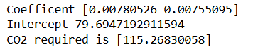

# Implementation of Multivariate Linear Regression
## Aim
To write a python program to implement multivariate linear regression and predict the output.
## Equipment’s required:
1.	Hardware – PCs
2.	Anaconda – Python 3.7 Installation / Moodle-Code Runner
## Algorithm:
### Step1
Load the dataset.

### Step2
Select Volume and Weight as features and CO2 as the target.

### Step3
Train a linear regression model.

### Step4
Retrieve coefficients and intercept.

### Step5
Predict CO2 for the given input [3300, 1300].

## Program:
```
Developed By:Pandeeswaran N
Register No:24901111

    import pandas as pd
    from sklearn import linear_model
    df=pd.read_csv("car (1).csv")
    x=df[['Volume','Weight']]
    y=df['CO2']
    regression=linear_model.LinearRegression()
    regression.fit(x,y)
    print("Coefficent",regression.coef_)
    print("Intercept",regression.intercept_)
    print("CO2 required is",regression.predict([[3300,1300]]))


```
## Output:


## Result
Thus the multivariate linear regression is implemented and predicted the output using python program.